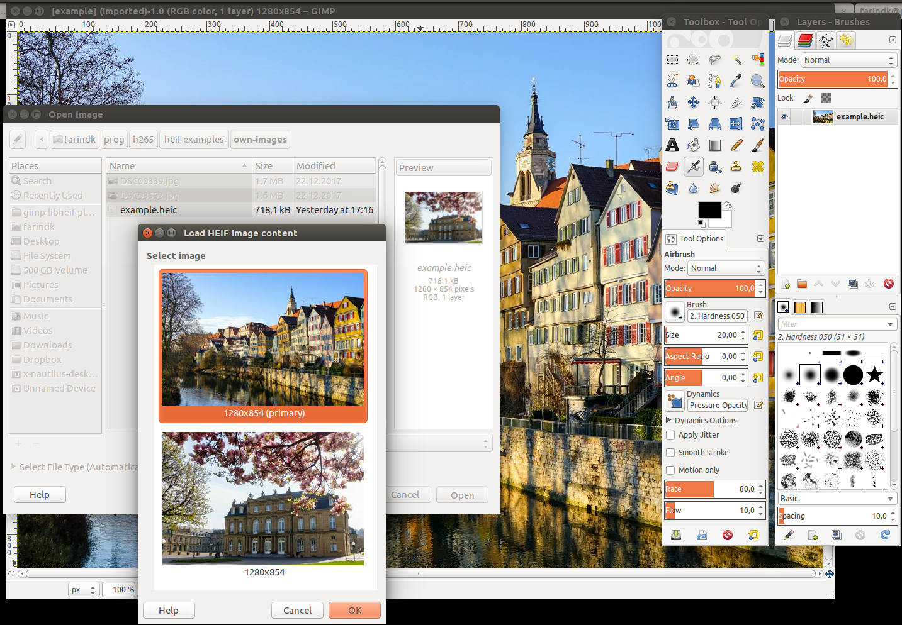

# HEIF plugin for GIMP

This is a GIMP plugin for loading HEIF images (High Efficiency Image File Format).

HEIF is a new image file format employing HEVC (h.265) image coding for the
best compression ratios currently possible.

## Screenshot

## Usage

HEIF files can contain several images in one file. When opening such a file,
a dialog will open to let you choose the image from a list of thumbnails.

## Installation

This code depends on [libheif](https://github.com/strukturag/libheif)
and [libde265](https://github.com/strukturag/libde265). You should install these
before compiling this plugin.

This plugin uses a standard autoconf/automake build system.
After downloading, run `./autogen.sh` to build the configuration scripts,
then call `./configure` and `make`.
Make sure that you compile and install [libde265](https://github.com/strukturag/libde265)
first, then [libheif](https://github.com/strukturag/libheif), so that the configuration script will find both.
Preferably, download the `frame-parallel` branch of libde265, as this uses a
more recent API than the version in the `master` branch.

After compilation, copy the file `src/heif-gimp-plugin` into your GIMP plugin directory
(for example, `$HOME/.gimp-2.8/plug-ins`).
When starting GIMP, the HEIF file-format should now show in the list of supported formats when you open a file.

## License

The heif-gimp-plugin is distributed under the terms of the GNU General Public License.

See COPYING for more details.

Copyright (c) 2018 Struktur AG / Contact: Dirk Farin farin@struktur.de
